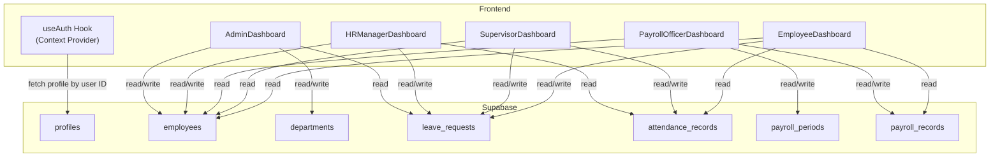
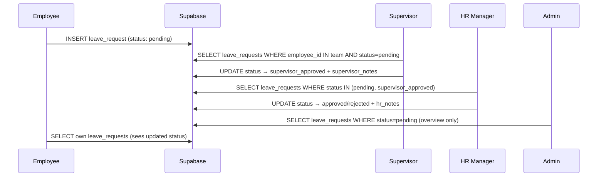
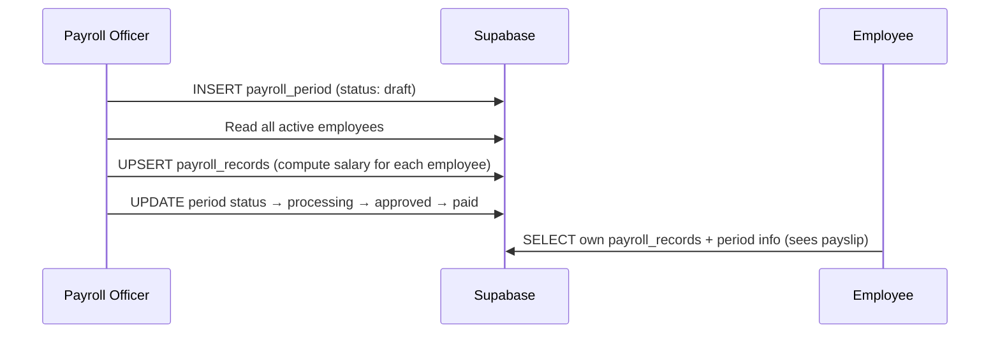
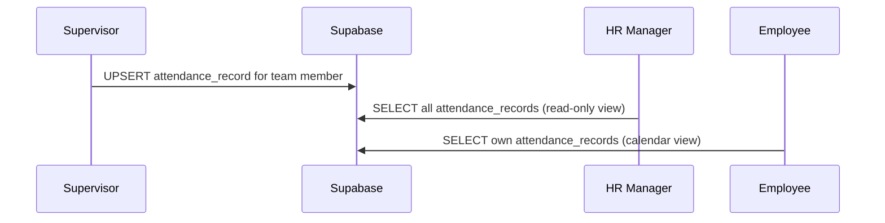
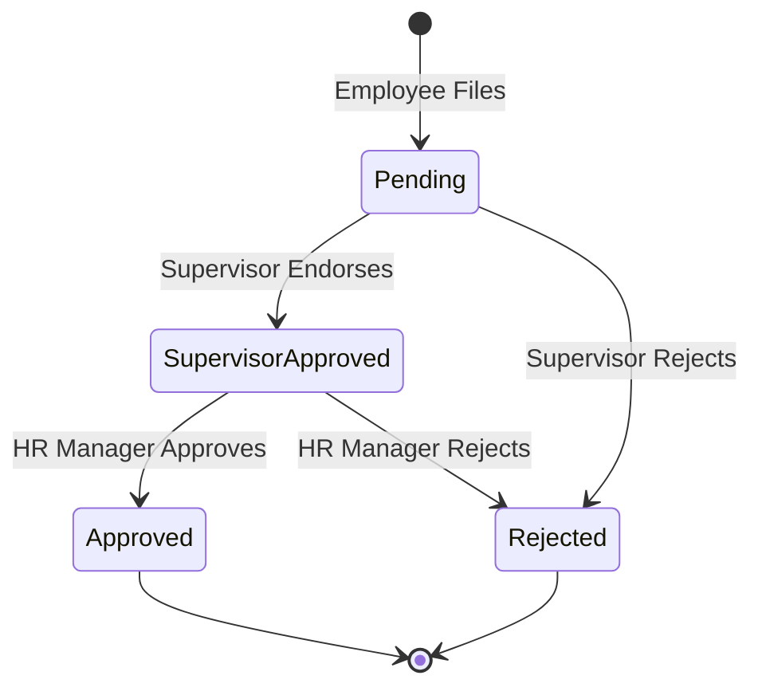

# HRMatrix — Data Fetching Architecture Analysis

## Overview

Your HRMatrix system uses **Supabase** (PostgreSQL + REST API) as the single source of truth. Every role-based dashboard fetches data directly from Supabase on mount, and roles interact with each other **through shared database tables** — there is no direct component-to-component data passing between roles.

---

## System Architecture

---

## How Each Role Fetches Data

### 1. Auth (Global — [useAuth.tsx](file:///c:/Users/clare/Downloads/hrmatrix-main/hrmatrix-main/src/hooks/useAuth.tsx))
| What | Query | When |
|------|-------|------|
| Current user profile | `profiles` → `.select('*').eq('id', userId).single()` | On login / session restore |

> [!IMPORTANT]
> [useAuth](file:///c:/Users/clare/Downloads/hrmatrix-main/hrmatrix-main/src/hooks/useAuth.tsx#81-86) is the **only shared context**. Every dashboard reads `profile.role` to decide which data to load, and `profile.id` to scope personal queries.

---

### 2. Admin Dashboard ([AdminDashboard.tsx](file:///c:/Users/clare/Downloads/hrmatrix-main/hrmatrix-main/src/pages/AdminDashboard.tsx))
| Data | Table | Query | Shared With |
|------|-------|-------|-------------|
| All employees | `employees` | `.select('*').order('created_at', desc)` | HR, Payroll, Supervisor |
| All departments | `departments` | `.select('*').order('name')` | Admin only |
| Pending leaves | `leave_requests` | `.select('*, employee:employees(*)').eq('status','pending').limit(10)` | HR, Supervisor |

**Writes:** Insert into `employees`, insert into `departments`, delete from `employees`

> [!NOTE]
> Audit Logs section uses **mock data** (`mockLogs` array), not real Supabase queries. System Settings section also uses hardcoded values.

---

### 3. HR Manager Dashboard ([HRManagerDashboard.tsx](file:///c:/Users/clare/Downloads/hrmatrix-main/hrmatrix-main/src/pages/HRManagerDashboard.tsx))
| Data | Table | Query | Shared With |
|------|-------|-------|-------------|
| All employees | `employees` | `.select('*').order('full_name')` | Admin, Payroll, Supervisor |
| All leave requests | `leave_requests` | `.select('*, employee:employees(*)').order('created_at', desc)` | Admin, Supervisor, Employee |
| Recent attendance | `attendance_records` | `.select('*, employee:employees(*)').order('date', desc).limit(50)` | Supervisor, Employee |

**Writes:** Update `leave_requests` (approve/reject with `hr_notes`), update `employees` (edit details), insert into `leave_requests`

---

### 4. Payroll Officer Dashboard ([PayrollOfficerDashboard.tsx](file:///c:/Users/clare/Downloads/hrmatrix-main/hrmatrix-main/src/pages/PayrollOfficerDashboard.tsx))
| Data | Table | Query | Shared With |
|------|-------|-------|-------------|
| All payroll periods | `payroll_periods` | `.select('*').order('created_at', desc)` | Employee (read-only) |
| Active employees | `employees` | `.select('*').eq('status','active').order('full_name')` | Admin, HR, Supervisor |
| Payroll records (per period) | `payroll_records` | `.select('*, employee:employees(*)').eq('period_id', id)` | Employee (read-only) |

**Writes:** Insert `payroll_periods`, upsert `payroll_records` (generate payroll), update period/record status (approve, mark paid), update individual `payroll_records`

---

### 5. Supervisor Dashboard ([SupervisorDashboard.tsx](file:///c:/Users/clare/Downloads/hrmatrix-main/hrmatrix-main/src/pages/SupervisorDashboard.tsx))
| Data | Table | Query | Shared With |
|------|-------|-------|-------------|
| All active employees | `employees` | `.select('*').eq('status','active')` then filters by `supervisor_id` | Admin, HR, Payroll |
| Supervisor's own employee record | `employees` | `.select('id').eq('profile_id', profile.id).single()` | — |
| Team pending leaves | `leave_requests` | `.select('*, employee:employees(*)').in('employee_id', teamIds).eq('status','pending')` | HR, Employee |
| Team all leaves | `leave_requests` | `.select('*, employee:employees(*)').in('employee_id', teamIds)` | HR, Employee |
| Team attendance | `attendance_records` | `.select('*, employee:employees(*)').in('employee_id', teamIds).limit(30)` | HR, Employee |

**Writes:** Update `leave_requests` (endorse to HR as `supervisor_approved` or reject), upsert `attendance_records`

---

### 6. Employee Dashboard ([EmployeeDashboard.tsx](file:///c:/Users/clare/Downloads/hrmatrix-main/hrmatrix-main/src/pages/EmployeeDashboard.tsx))
| Data | Table | Query | Shared With |
|------|-------|-------|-------------|
| Own employee record | `employees` | `.select('*').eq('profile_id', profile.id).single()` | — |
| Own leave requests | `leave_requests` | `.select('*').eq('employee_id', emp.id)` | HR, Supervisor |
| Own attendance | `attendance_records` | `.select('*').eq('employee_id', emp.id).limit(30)` | HR, Supervisor |
| Own payslips | `payroll_records` | `.select('*, period:payroll_periods(period_name, pay_date)').eq('employee_id', emp.id)` | Payroll |

**Writes:** Insert into `leave_requests` (file leave)

> [!TIP]
> The Employee Dashboard is the **only** page that uses **Supabase Realtime subscriptions** — it listens for changes on `attendance_records`, `leave_requests`, and `payroll_records` to auto-refresh.

---

## Key Data Flows Between Roles

### Leave Request Workflow

### Payroll Flow

### Attendance Flow

---

## Detailed Operational Matrix

| Role | Core Operations | Primary Data Access |
| :--- | :--- | :--- |
| **Admin** | System configuration, Role assignment, Department creation, Global Overrides, Data Exports | Full System Access (Audit Logs, Profiles, Departments) |
| **HR Manager** | Employee onboarding/offboarding, Salary updates, Final Leave approval, Attendance monitoring | Employees, Leave Requests, Attendance Records |
| **Payroll Officer** | Payroll cycle management, Tax/Contribution calculations, Net Pay finalization | Payroll Periods, Payroll Records, Employee Salaries |
| **Supervisor** | Team attendance logging, Leave endorsements, Team performance monitoring | Team-specific Employees, Leave Requests, Attendance |
| **Employee** | Self-service attendance, Leave filing, Payslip viewing, Profile management | Personal Profile, Own Leaves, Own Payslips |

---

## Detailed Leave Lifecycle (State Transition)

Leave requests transition through several states, requiring multi-role intervention:

---

## Fetching Patterns Summary

| Pattern | Used By | Details |
|---------|---------|---------|
| `Promise.all` parallel fetch | All dashboards | Each dashboard loads all its data in parallel on mount |
| Foreign key join via `select('*, employee:employees(*)')` | Admin, HR, Supervisor, Payroll | Joins related employee data into leave/attendance/payroll records |
| Scoped queries using `profile.id` | Supervisor, Employee | Filters data to only "my team" or "my records" |
| Refetch after mutation | All dashboards | Every write operation calls [fetchAll()](file:///c:/Users/clare/Downloads/hrmatrix-main/hrmatrix-main/src/pages/PayrollOfficerDashboard.tsx#25-40) to reload fresh data |
| Realtime subscriptions | Employee only | Auto-refreshes on changes to `attendance_records`, `leave_requests`, `payroll_records` |
| Mock/hardcoded data | Admin | Audit logs, system config, and session info are not from the DB |

---

## Potential Issues & Observations

> [!WARNING]
> ### 1. No Shared State Between Roles
> Each dashboard independently fetches its own copy of data. If the Admin adds an employee, the HR Manager won't see it until they refresh. Only the Employee dashboard has realtime subscriptions.

> [!WARNING]
> ### 2. Audit Logs Are Mock Data
> The Admin's audit log uses a hardcoded `mockLogs` array — it does not read from the `audit_logs` table in the database. The table exists in the schema but is never written to or queried.

> [!CAUTION]
> ### 3. Admin "Add User" Only Creates Employee, Not Auth User
> [handleAddEmployee()](file:///c:/Users/clare/Downloads/hrmatrix-main/hrmatrix-main/src/pages/AdminDashboard.tsx#62-79) inserts into the `employees` table but does **not** create a Supabase auth user or a `profiles` record. The created "employee" has no `profile_id` and cannot log in. The password field on the form is collected but never used.

> [!WARNING]
> ### 4. Leave Balance Is Hardcoded
> The Employee Dashboard shows leave balances as static mock data (`leaveBalances` array). There is no `leave_balances` table or computed logic from actual leave usage.

> [!NOTE]
> ### 5. Supervisor Fallback Shows Unscoped Data
> If the Supervisor has no employee record (no `profile_id` match), the fallback shows the first 10 employees from the entire org — not just their team (`allEmps.slice(0, 10)`).

> [!NOTE]
> ### 6. System Settings Are Not Persisted
> The Admin system settings (work start time, grace period, OT multiplier) are hardcoded default values in the form. Changes are not saved to any database table.

> [!NOTE]
> ### 7. Employee Profile Data Is Partially Hardcoded
> Some profile fields (Date of Birth, Gender, Civil Status, Address, Phone, SSS/PhilHealth/Pag-IBIG numbers, Supervisor name) are hardcoded strings, not fetched from the database.
