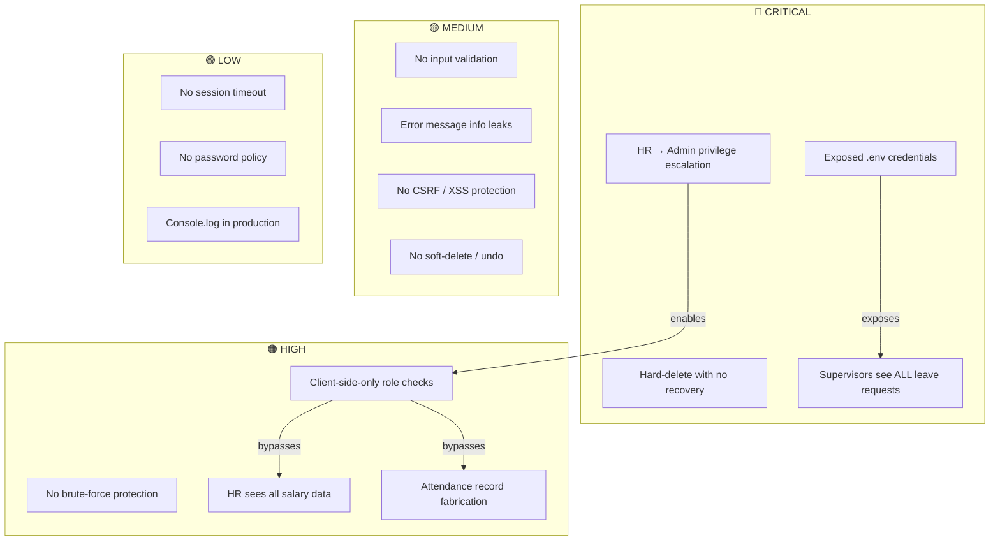

# HRMatrix — Security Vulnerability Report


**Date:** March 26, 2026  
**Severity Scale:** 🔴 Critical · 🟠 High · 🟡 Medium · 🟢 Low

---

## Severity Summary

| Severity | Count |
|----------|-------|
| 🔴 Critical | 4 |
| 🟠 High | 4 |
| 🟡 Medium | 4 |
| 🟢 Low | 3 |

---

## 🔴 Critical Vulnerabilities

### 1. Exposed Supabase Credentials in [.env](file:///c:/Users/clare/Downloads/hrmatrix-main/hrmatrix-main/.env) (Committed to Repo)

**File:** [.env](file:///c:/Users/clare/Downloads/hrmatrix-main/hrmatrix-main/.env)

Your [.env](file:///c:/Users/clare/Downloads/hrmatrix-main/hrmatrix-main/.env) file containing the Supabase URL and anon key is committed to the repository. While the `VITE_SUPABASE_ANON_KEY` is designed to be public, if this repo is shared or pushed to GitHub, anyone can directly call your Supabase API.

**Risk:** If RLS policies are misconfigured (and they are — see below), attackers can read/write any table using just the anon key + URL.

---

### 2. RLS Privilege Escalation — Any HR Manager Can Become Admin

**File:** [schema.sql, lines 166-168](file:///c:/Users/clare/Downloads/hrmatrix-main/hrmatrix-main/schema.sql#L166-L168)

```sql
CREATE POLICY "Profiles: admin all" ON profiles USING (
  EXISTS (SELECT 1 FROM profiles p WHERE p.id = auth.uid() AND p.role IN ('admin','hr_manager'))
);
```

This is a **FOR ALL** policy (covers SELECT, INSERT, UPDATE, DELETE). An HR Manager can:
1. Update their own `profiles.role` to `'admin'`
2. Change any other user's role
3. Delete any user's profile

**Attack:** A rogue HR Manager can elevate themselves to Admin and take full control of the system.

---

### 3. No Authorization on Delete — Any Authenticated User Can Delete Employees

**File:** [schema.sql, lines 172-174](file:///c:/Users/clare/Downloads/hrmatrix-main/hrmatrix-main/schema.sql#L172-L174)

```sql
CREATE POLICY "Employees: admin/hr write" ON employees FOR ALL USING (
  EXISTS (SELECT 1 FROM profiles p WHERE p.id = auth.uid() AND p.role IN ('admin','hr_manager'))
);
```

Combined with the profile privilege escalation above, the employee deletion in [AdminDashboard.tsx](file:///c:/Users/clare/Downloads/hrmatrix-main/hrmatrix-main/src/pages/AdminDashboard.tsx) uses a simple `confirm()` dialog — no server-side validation, no soft-delete, no audit trail.

**Risk:** Data is permanently destroyed with no recovery path.

---

### 4. Leave Request RLS Allows Supervisor to See ALL Leaves (Not Just Their Team)

**File:** [schema.sql, lines 189-191](file:///c:/Users/clare/Downloads/hrmatrix-main/hrmatrix-main/schema.sql#L189-L191)

```sql
CREATE POLICY "Leave: supervisor own dept" ON leave_requests FOR SELECT USING (
  EXISTS (SELECT 1 FROM profiles p WHERE p.id = auth.uid() AND p.role = 'supervisor')
);
```

This policy has **no department or team filter**. Any Supervisor can query `leave_requests` and see **every leave request in the entire organization**, including those from other departments with sensitive medical/personal reasons.

---

## 🟠 High Vulnerabilities

### 5. No Brute-Force Protection on Login

**File:** [LoginPage.tsx](file:///c:/Users/clare/Downloads/hrmatrix-main/hrmatrix-main/src/pages/LoginPage.tsx)

There is no:
- Rate limiting on login attempts
- Account lockout after failed attempts
- CAPTCHA or challenge mechanism
- Delay/backoff between retries

While Supabase has some built-in rate limiting, the frontend does nothing to prevent automated brute-force attacks.

---

### 6. Client-Side Role Routing — No Server-Side Authorization Enforcement

**File:** [App.tsx, lines 150-165](file:///c:/Users/clare/Downloads/hrmatrix-main/hrmatrix-main/src/App.tsx#L150-L165)

Role-based access is enforced **entirely on the client side**:

```tsx
switch (role) {
  case 'admin': return <AdminDashboard />
  case 'hr_manager': return <HRManagerDashboard />
  // ...
}
```

An attacker can:
1. Open browser DevTools
2. Modify the React state or `profile.role` value
3. Access any dashboard (Admin, HR, Payroll)
4. Because RLS policies are too permissive, the Supabase queries will also succeed

**Risk:** Any authenticated user can impersonate any role by manipulating client-side state.

---

### 7. Payroll Data Accessible to Unauthorized Roles via Direct API Calls

**File:** [schema.sql, lines 211-214](file:///c:/Users/clare/Downloads/hrmatrix-main/hrmatrix-main/schema.sql#L211-L214)

```sql
CREATE POLICY "Payroll records: own read" ON payroll_records FOR SELECT USING (
  employee_id IN (SELECT id FROM employees WHERE profile_id = auth.uid())
  OR EXISTS (SELECT 1 FROM profiles p WHERE p.id = auth.uid()
             AND p.role IN ('admin','hr_manager','payroll_officer'))
);
```

HR Managers can see **all payroll records** including salary information for every employee. While this may be intentional, it means HR has visibility into compensation data which is typically restricted to Payroll and Finance.

---

### 8. Attendance Records — Supervisors/HR Can Fabricate Records

**File:** [schema.sql, lines 200-202](file:///c:/Users/clare/Downloads/hrmatrix-main/hrmatrix-main/schema.sql#L200-L202)

```sql
CREATE POLICY "Attendance: hr/admin all" ON attendance_records FOR ALL USING (
  EXISTS (SELECT 1 FROM profiles p WHERE p.id = auth.uid()
          AND p.role IN ('admin','hr_manager','supervisor'))
);
```

Any Supervisor can insert/update/delete attendance records for **any employee** (not just their team). This enables:
- Fabricating attendance for non-team members
- Backdating or modifying time records
- Deleting evidence of absence

---

## 🟡 Medium Vulnerabilities

### 9. No Input Validation or Sanitization

**All dashboard files**

User inputs are passed directly to Supabase without validation:

```tsx
// AdminDashboard.tsx — employee name not validated
full_name: `${newUser.first_name} ${newUser.last_name}`.trim()

// No email format validation beyond HTML type="email"
// No salary bounds checking
// No date range validation (end_date could be before start_date)
```

**Risk:** Malformed data, SQL injection via Supabase's ORM layer (unlikely but possible), and business logic bypasses (negative salaries, zero-day leaves, etc.)

---

### 10. Error Messages Leak Internal Details

**Files:** All dashboards

```tsx
showToast('Error: ' + error.message, '❌')
```

Supabase error messages are shown directly to users. These can reveal:
- Table and column names
- RLS policy violation details
- Database constraint information

**Risk:** Information disclosure that helps attackers map the database schema.

---

### 11. No CSRF Protection

The app uses Supabase's JWT-based auth stored in `localStorage`. While JWTs are immune to traditional CSRF, storing auth tokens in `localStorage` makes them vulnerable to XSS attacks. If any XSS vulnerability exists, the token can be stolen.

---

### 12. `confirm()` for Destructive Actions — No Undo/Soft-Delete

**File:** [AdminDashboard.tsx, line 90](file:///c:/Users/clare/Downloads/hrmatrix-main/hrmatrix-main/src/pages/AdminDashboard.tsx#L90)

```tsx
async function handleDeleteEmployee(id: string) {
  if (!confirm('Delete this employee?')) return
  await supabase.from('employees').delete().eq('id', id)
}
```

- Uses browser `confirm()` which can be bypassed programmatically
- Hard-deletes with cascading effects (all leave requests, attendance, payroll records lost via `ON DELETE CASCADE`)
- No audit log of the deletion

---

## 🟢 Low Vulnerabilities

### 13. No Session Timeout / Idle Logout

The app never expires the user's session. If someone walks away from their computer, anyone can access the system. Government/LGU systems typically require idle timeouts of 15-30 minutes.

---

### 14. No Password Policy Enforcement

The signup/user creation flow has no requirements for:
- Minimum password length
- Complexity rules (uppercase, numbers, symbols)
- Password expiration/rotation

This relies entirely on Supabase's defaults (6-character minimum).

---

### 15. Console Logging of Sensitive Data

**File:** [useAuth.tsx, lines 23 & 31](file:///c:/Users/clare/Downloads/hrmatrix-main/hrmatrix-main/src/hooks/useAuth.tsx#L23-L31)

```tsx
console.log('fetchProfile called with:', userId)
console.log('fetchProfile result:', { data, error })
```

User IDs and full profile data (including role, email) are logged to the browser console in production. Anyone with DevTools open can see this.

---

## Visual Summary



---

## Recommended Priority Fixes

| Priority | Fix | Effort |
|----------|-----|--------|
| 1 | Tighten RLS policies — scope Supervisor/HR access by department/team | Medium |
| 2 | Remove HR Manager from `profiles` write policy (prevent privilege escalation) | Low |
| 3 | Add `.gitignore` for [.env](file:///c:/Users/clare/Downloads/hrmatrix-main/hrmatrix-main/.env) and rotate the Supabase anon key | Low |
| 4 | Add server-side role validation (Supabase Edge Functions or RLS) | Medium |
| 5 | Implement soft-delete + audit logging for all mutations | Medium |
| 6 | Add rate limiting / lockout on login | Low |
| 7 | Remove `console.log` statements from production code | Low |
| 8 | Add input validation (dates, salary ranges, required fields) | Medium |
| 9 | Add session idle timeout | Low |
| 10 | Add error message sanitization (don't expose raw DB errors) | Low |
