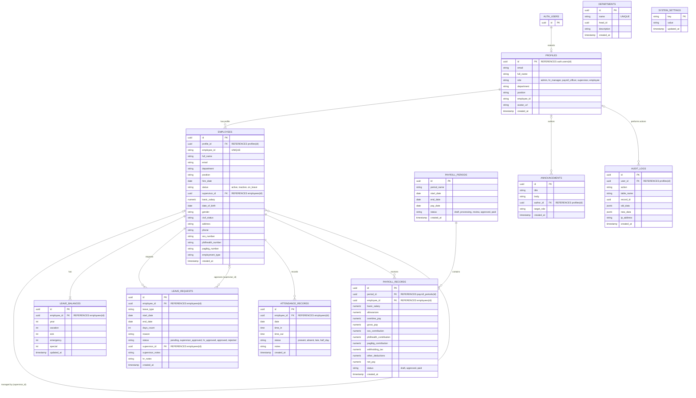

# HRMatrix System Diagrams

*Note: The file `very_latest.sql` was empty, so these diagrams were generated based on the actual schema found in `sql implemented/schema.sql`.*

## Entity Relationship Diagram (ERD)



## Use Case Diagram

*Built with `flowchart LR` as standard Mermaid Use Case support is limited.*

```mermaid
flowchart LR
    %% Actors
    Emp(fa:fa-user Employee)
    Sup(fa:fa-user-tie Supervisor)
    HR(fa:fa-users HR Manager)
    Pay(fa:fa-wallet Payroll Officer)
    Adm(fa:fa-user-shield Admin)

    %% System Boundary
    subgraph System[HRMatrix Main Operations]
        %% Use Cases
        UC_Profile([View Profile & Info])
        UC_Announce([View Announcements])
        UC_ReqLeave([Request Leave])
        UC_MyAtt([View My Attendance])
        UC_MyPay([View My Payslip])
        
        UC_AppLeaveSup([Approve Team Leave])
        UC_TeamAtt([Monitor Team Attend.])
        
        UC_MngEmp([Manage Employees])
        UC_AppLeaveHR([Final Approve Leave])
        UC_CompAtt([Manage Company Attend.])
        UC_PostAnn([Post Announcements])
        
        UC_ProcPay([Process Payroll])
        UC_CalcPay([Calc Deductions])
        
        UC_SysSet([Manage System Settings])
        UC_Audit([View Audit Logs])
    }

    %% Actor Inheritances (Implicit via links to base uses or direct links)
    %% In flowchart, we just hook up the actors to their use cases
    
    %% Employee
    Emp --> UC_Profile
    Emp --> UC_Announce
    Emp --> UC_ReqLeave
    Emp --> UC_MyAtt
    Emp --> UC_MyPay

    %% Supervisor
    Sup --> UC_Profile
    Sup --> UC_AppLeaveSup
    Sup --> UC_TeamAtt

    %% HR Manager
    HR --> UC_Profile
    HR --> UC_MngEmp
    HR --> UC_AppLeaveHR
    HR --> UC_CompAtt
    HR --> UC_PostAnn

    %% Payroll Officer
    Pay --> UC_Profile
    Pay --> UC_ProcPay
    Pay --> UC_CalcPay

    %% Admin
    Adm --> UC_MngEmp
    Adm --> UC_PostAnn
    Adm --> UC_SysSet
    Adm --> UC_Audit
```
